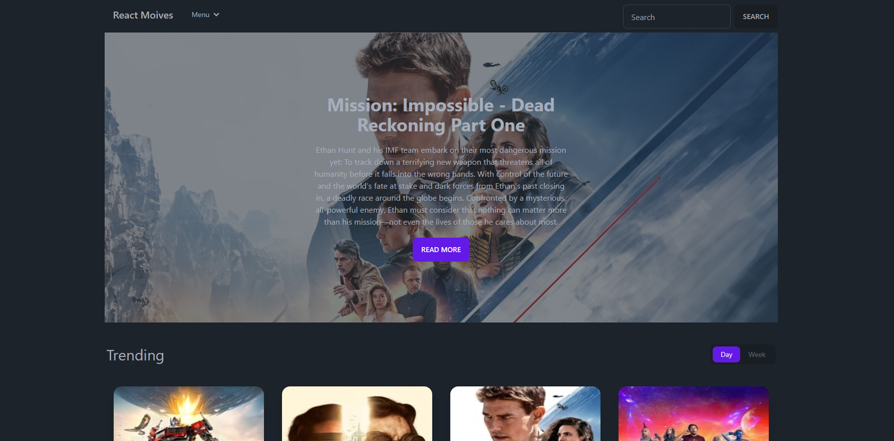

# [React Movies](https://react-moive-app-delta.vercel.app/)

This is an open source movies website for all movies, tvshows details, casts, and releasedate build with `React.js`.

[](https://react-moive-app-delta.vercel.app/)

## Tech Stack

- [React.js](https://nextjs.org)
- [Tailwind CSS](https://tailwindcss.com)
- [React-Router-Dom](https://reactrouter.com/)
- [SWR](https://swr.vercel.app/)

## Features to be implemented

- [x] Search with **Name**
- [x] Filter with **TvShows/Movie - Week/Day**
- [x] Pagination
- [x] Movie Details,Casts,Similar,Recommendations.

## Installation

### 1. Clone the repository

```bash
git clone https://github.com/M-ZENHOM/REACT_MOIVE_APP
```

### 2. Install dependencies

```bash
npm install
```

### 3. Create a `.env` file

Create a `.env` file in the root directory and add the environment variables as shown in the `.env.example` file.

### 4. Run the application

```bash
npm run dev
```

## How do I deploy this?

Follow the deployment guides for [Vercel](https://create.t3.gg/en/deployment/vercel), [Netlify](https://create.t3.gg/en/deployment/netlify) and [Docker](https://create.t3.gg/en/deployment/docker) for more information.
